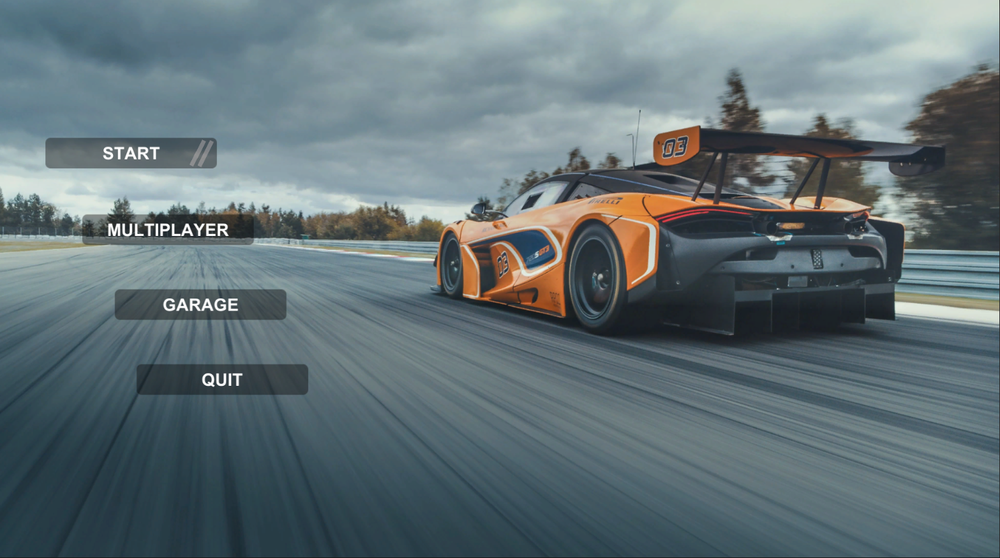
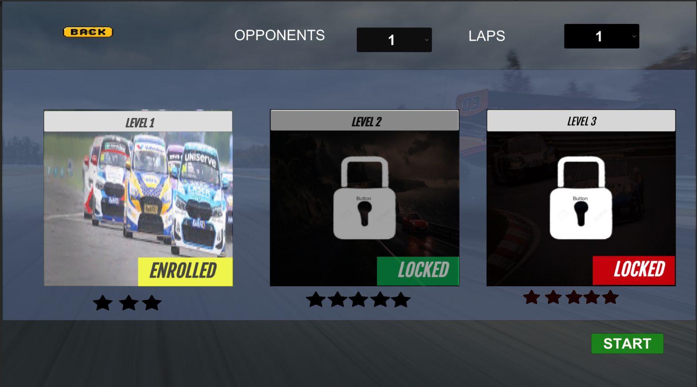
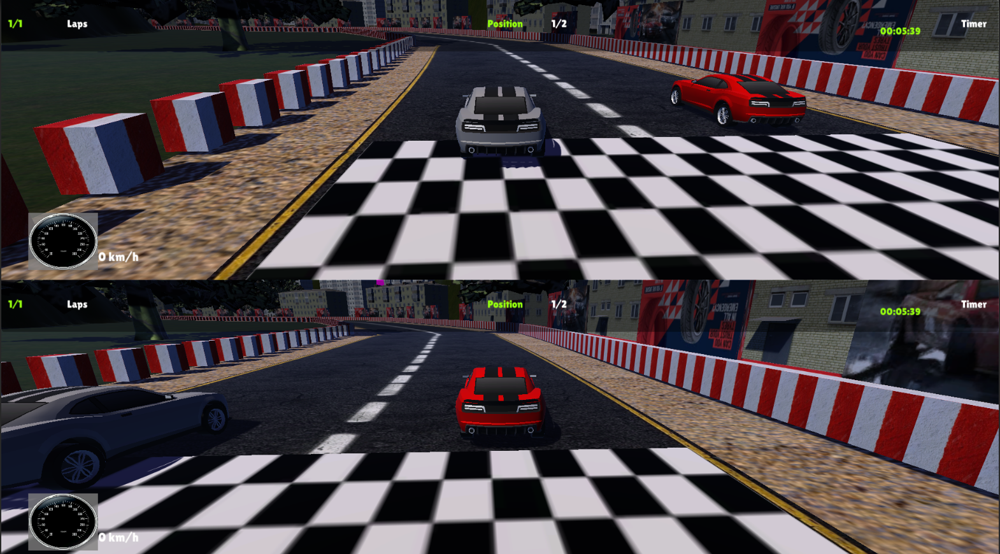
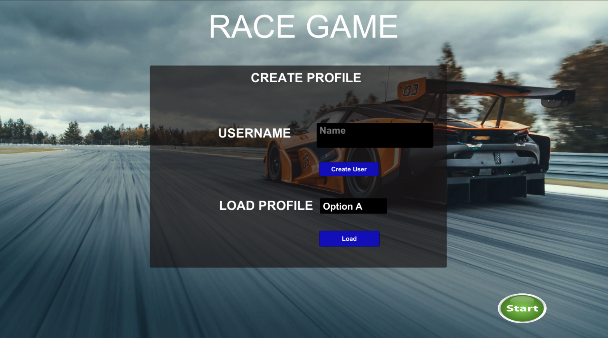
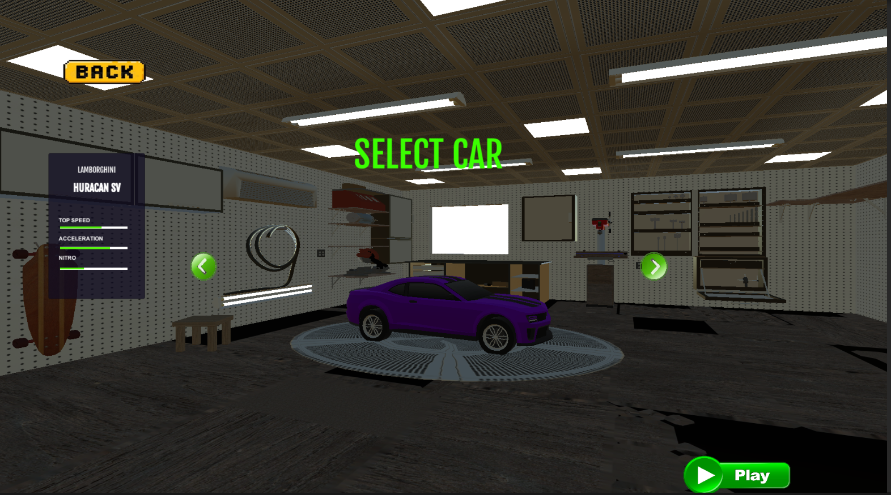

# 🏎️ 3D Car Racing Game – Final Year Project (Unity)

A 3D car racing game made using Unity and C#.  
Built as my Final Year Project, this game features AI-controlled opponents, a profile-based save system, level unlocking through star collection, and split-screen multiplayer.

---

## 🎮 Features

- 🎯 3 Unique Levels with different tracks and surroundings
- 🤖 AI-controlled cars using path-following behavior
- 🌟 Star-based level unlocking system
- 👤 Local profile creation with progress saving
- 🧠 Realistic but simplified car mechanics (drifting & steering)
- 🧑‍🤝‍🧑 Local multiplayer with split-screen support
- 📊 Finish UI showing race position and time
- 🎮 No external dependencies – Fully offline

---

## 🎮 Controls

**Single Player:**
- Movement: `W, A, S, D`
- Brake: `Left Shift`

**Multiplayer:**
- Player 1: `W, A, S, D` + `Left Shift` (Brake)
- Player 2: `Arrow Keys` + `Space` (Brake)

---

## 🖼️ Screenshots

  
  
  
  
  

## 📦 Download and Play the Game

You can download and play the `.exe` build here:  
👉 [Download from Google Drive](https://drive.google.com/file/d/1jnwMIaLlQ-UCpHOa8liLM614qF2uaAOO/view?usp=sharing)

> Just extract the zip file and run `3D_Racing_Game.exe`. No installation needed.

---
## 🎥 Gameplay Demo

👉 [🎬 Watch on Google Drive](https://drive.google.com/file/d/1sSxvJDsp-xuCfhHmNQM0w1NQwdA244cY/view?usp=sharing)

## 🧠 Built With

- Unity (C#)
- Unity UI System
- PlayerPrefs (for saving profiles)
- Custom AI Logic
- Input Manager (for split screen)

---

## 👨‍💻 Developer

**Huzaifa Asad**  
💼 Game Developer | Unity Programmer  
📧 huzaifaasad2003@email.com  

---

> 📝 This repository only contains documentation and download link. Full source code available upon request.
